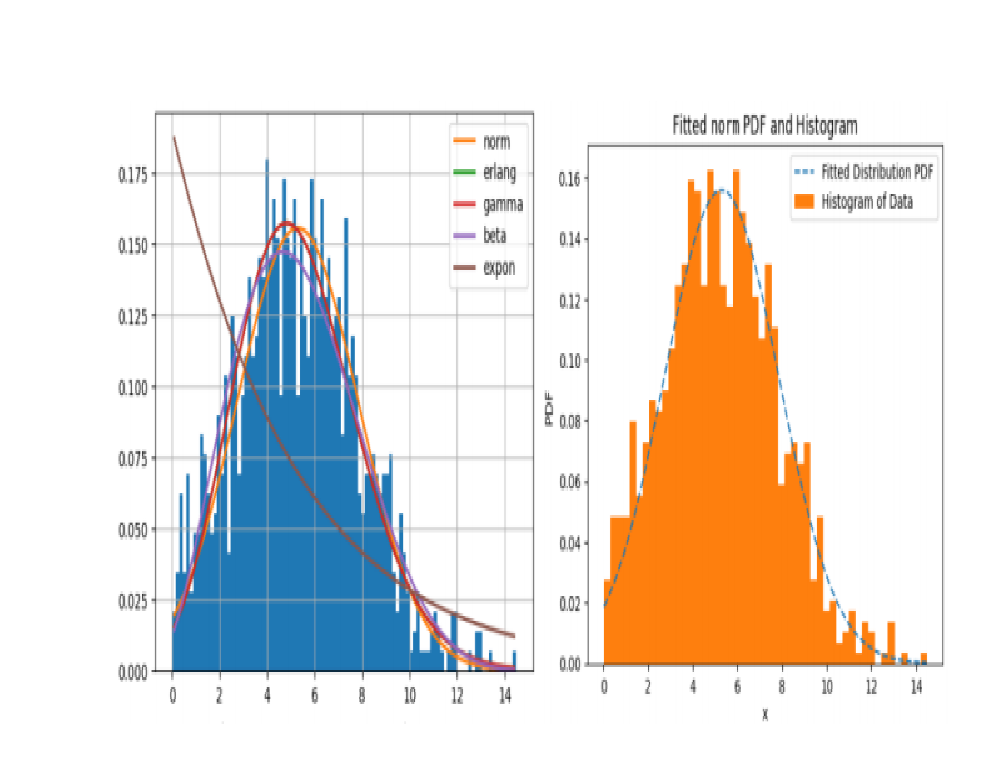
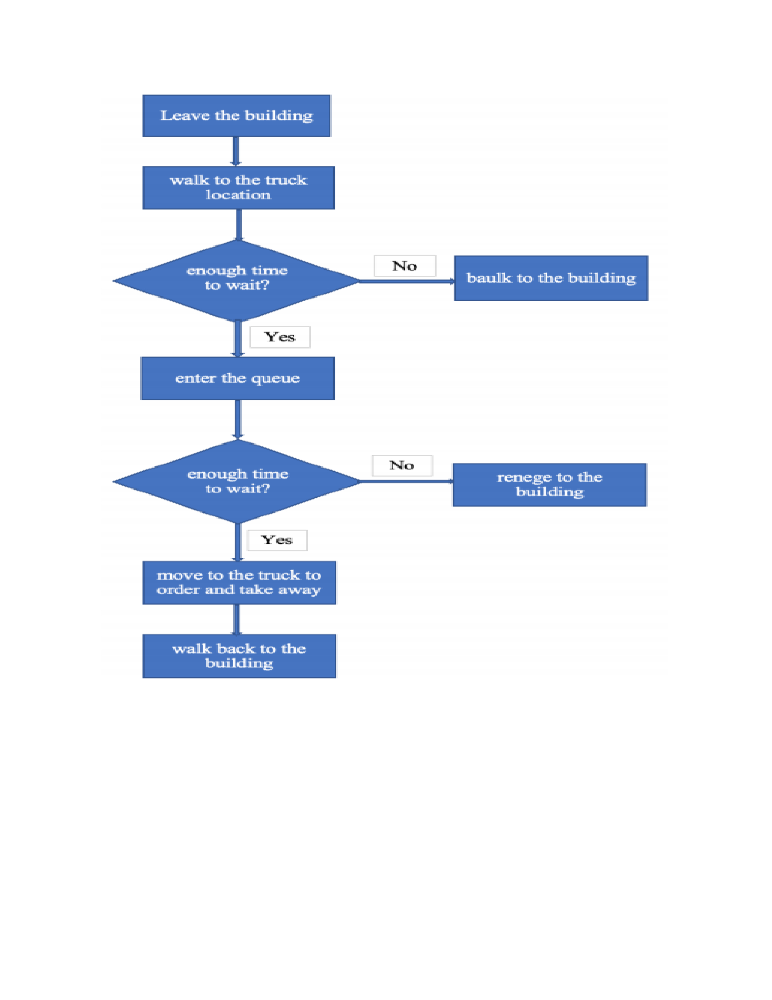

# Business Process Simulation _ Burito restaurent

## :information_source: GENERAL INFORMATION
- :bulb: Purpose: The project aims to provide an extensive analysis of simulation models to support the 
decision making process about the suitability of the optimization solution and the idea of expanding the 
capacity. 

- :file_folder: List of files:
  + data sources 
  + optimization models
  + simulation models

## :one: Methodology:

**:computer: :one: Optimization (AMPL Software)**
- An optimization model with different scenarios is used to determine the optimal truck 
locations, the number of trucks, and the expected profit.

**:computer: :two: Simulation (JaamSim Software)**
- Different simulation models are run to 
incorporate uncertainty elements to validate the suitability of the optimization solution, and find the most 
suitable plan to implement with the target to maximize profit and minimize the number of unsatisfied 
customers.
- Note: As serving time and customer walking time are uncertain. I fit the historical data to find the best fitted distributions to build the simulation models.

## :three: :convenience_store: Business Operation Flowchart

- Customers leave their buildings at the start of the break and go to the truck location. If they do not have 
enough time for waiting and walking back to their buildings, they will not enter the queue. Otherwise, 
they wait in the queue until they are served. If their remaining time equals their walking time plus service 
time and they are still waiting, they leave the queue and walk back to their building. Customers who stay 
in the queue are served and then walk back to their buildings. All customers must be back at their 
buildings by the end of the break time.

## :four: :clipboard: Result
- To provide a solid and statistically based recommendation for food truck operations, output analysis is 
conducted. The analysis focuses on changes in KPIs over simulation time and financial KPIs.

- The optimization model assumes that the truck capacity can serve all customers, but this 
assumption is too optimistic.

- There is a significant difference in the 
KPIs between the simulation model 
and the optimization model, with the 
latter showing much higher 
estimated total sales and total profit.

- The optimization model successfully determined the optimal number and placement of trucks for 
Guroble. However, as it did not account for uncertainties in the operation, such as weather conditions and 
customer time constraints, the expected KPIs suggested by the model may be invalid, specifically 
overestimated. Therefore, simulation models were used to propose a more suitable operation plan that 
considers these uncertainties. 

